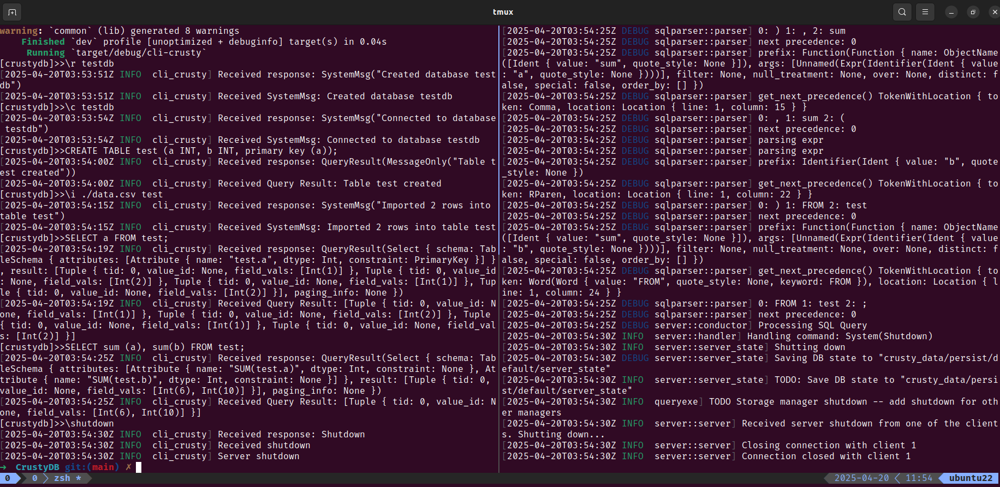

# How to test

运行单元测试或者集成测试，可以使用
```shell
cargo test
```
和
```shell
cargo test -- --ignored
```
所有测试都应该通过。

运行客户端，可以采取以下步骤:

打开两个terminal（或者使用tmux），
在其中一个运行
```shell
./debug-server.sh
``` 
推荐采用这种方式，可以看到一些日志

在另一个terminal运行
```shell
./client.sh
```
然后依次输入以下命令:
```
\r testdb

\c testdb

CREATE TABLE test (a INT, b INT, primary key (a));

\i ./data.csv test

SELECT a FROM test;

SELECT sum (a), sum(b) FROM test;

\shutdown
```
如果一切正常，输出应该符合预期，你不应该看见任何error。


